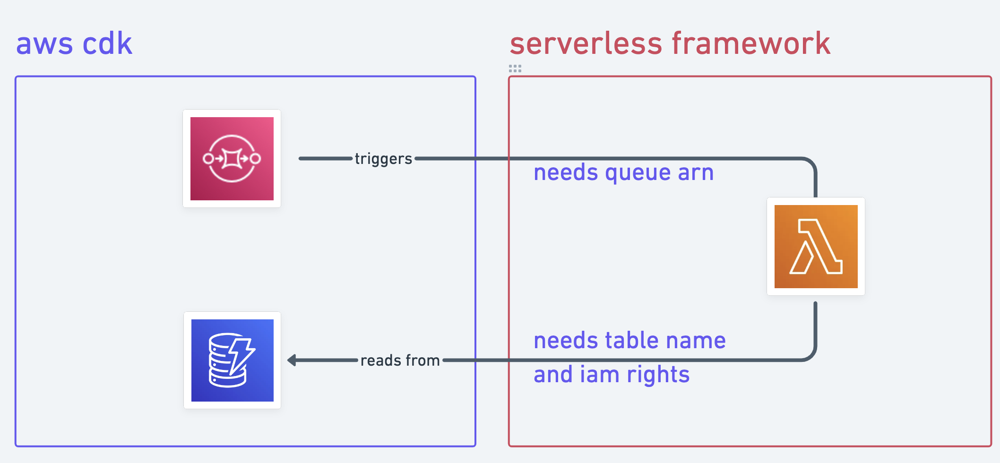

Serverless Framework and AWS CDK are two important players in the serverless development ecosystem. At first glance, you would think they are competitors, but I've been combining Serverless Framework, AWS CDK and Typescript for half a year to develop cloud-native applications. In my experience, it's mostly been a breeze - mostly 🥺.

## TL;DR

Combining [Serverless Framework](https://www.serverless.com/framework) and the [AWS Cloud Development Kit](https://github.com/aws/aws-cdk) forms one of the best stacks to reliably and quickly robust cloud-native applications.

To achieve that, I recommend using the [@swarmion/serverless-cdk-plugin](https://www.npmjs.com/package/@swarmion/serverless-cdk-plugin) plugin to seamlessly integrate your AWS CDK resources in Serverless Framework.

Most compelling pros:

- 🏗 Leverage the no. 1 framework's (Serverless framework) awesome community and developer experience to create and deploy lambdas,

- 🍭 Easily create other AWS resources thanks to the AWS CDK's higher levels abstractions,

- 👷 Build a state-of-the-art serverless app by writing your application's logic and configuration in the same repository with Typescript (strongly typed infrastructure as code 🧞‍♂️!).

How does it work?

1. Build your cloud-native application using Serverless Framework.

2. Create non-lambda AWS resources (DynamoDB tables, SQS queues, EventBridge's event buses, etc.) using the [aws-cdk-lib](https://www.npmjs.com/package/aws-cdk-lib) (the aws-cdk v2).

3. Leverage Serverless Framework's powerful plugin ecosystem and install the [@swarmion/serverless-cdk-plugin](https://www.npmjs.com/package/@swarmion/serverless-cdk-plugin). Check out [our github open source repository](https://github.com/swarmion/swarmion/tree/main/packages/serverless-cdk-plugin)!

4. Reference your aws-cdk construct in your Serverless framework configuration file.

5. That's it! Serverless Framework seamlessly provisions these resources on deployment.

```ts
// code/serverless-config.ts

// serverless.ts

import { AWS } from '@serverless/typescript';

import type { ServerlessCdkPluginConfig } from '@swarmion/serverless-cdk-plugin';

import { MyCdkConstruct } from 'resources/dynamodb';

const serverlessConfiguration: AWS & ServerlessCdkPluginConfig = {
  service: `my-service`,
  frameworkVersion: '*',
  provider: {
    name: 'aws',
    runtime: 'nodejs14.x',
  },

  // Import the plugin in your serverless configuration.
  plugins: ['@swarmion/serverless-cdk-plugin'],

  // Reference your custom aws-cdk construct at the "construct" key. That's it!
  construct: MyCdkConstruct,
  // ...More configuration props
};

module.exports = serverlessConfiguration;
```

## Building high quality Serverless apps

**Writing your application's logic and infrastructure as code in the same repository and language feels really good**. Nevertheless, have you ever tried to provision a DynamoDB table, a SQS queue or an EventBus with Serverless Framework? Being lambda-centric by design, this framework does not provision other AWS resources out-of-the-box for you.

From there, you have two options:

1. Handling the deployment of your other resources separately, for instance using the AWS CDK. [Sebastian Bille](https://dev.to/tastefulelk) wrote [a cool article](https://dev.to/aws-builders/combining-serverless-framework-aws-cdk-1dg0) about this subject. The main consequence of this approach is having two separate stacks that deploy independently. Nevertheless, one of the deployments might fail, for instance, due to circular dependencies between the two stacks - e.g. SQS => Lambda => SQS flow.

2. Have Serverless Framework provision your resources as part of its deployment cycle. The trade-off is having to write vanilla Cloud Formation. If you've never done it before, believe me, it's a DevX faux-pas 🙅. Thankfully, [Fred Barthelet](https://dev.to/fredericbarthelet) wrote [an awesome article](https://dev.to/kumo/serverless-framework-aws-cdk-1dnf) on how to replace vanilla Cloud Formation by AWS CDK constructs.

Essentially, `aws-cdk` stack classes have a transpilation method that allows the dev-friendly Typescript code you wrote to be transpiled to Cloud formation. The downside to this process is the necessity to write a lot of boilerplate code every time you need a new resource (SQS queue, etc.).

These two solutions solve many interesting use-cases that developers face when building cloud-native apps:



What if one could build an awesome Serverless application, use the AWS CDK for specific resources while having only one deployment process and no boilerplate?

#### Enter the @swarmion/serverless-cdk-plugin: a bridge between Serverless Framework and the AWS CDK.

At [Kumo](https://dev.to/kumo), we have worked on developing an awesome tool to achieve just that: a complete and stable typescript stack to build serverless applications. Did you know? Our plugin integrates seamlessly with [Swarmion](https://www.swarmion.dev/), a framework for Serverless Typescript microservices.

#### How does the plugin work?

Upon deploying (or packaging) your Serverless application (e.g. `sls deploy`), the `@swarmion/serverless-cdk-plugin` converts your `aws-cdk` construct code to Cloud Formation and integrates it in the Serverless deployment cycle under the hood. This is essentially some kind of transpilation (typescript => cloud formation). Then, Serverless Framework provisions it on deploy.

> 🚨 Caveats: Using AWS CDK with Serverless Framework does not allow you to deploy resources that require a so-called bootstrap stack.

> For instance, using the AWS CDK to create a lambda function. There, the bootstrap stack consists in provisioning an S3 bucket with the lambda's code. This S3 bucket would then be referenced and used at a later stage of the deployment cycle to provision the lambda function.

> Trying to create constructs that require a boostrap stack will thus result in a strange error at build time. The plugin helps in that it throws a very explicit error. The only way to deploy those type of constructs is to use a separate deployment process.

#### How can I use the plugin in my Serverless Framework app?

> 🎙 Disclaimer: This plugin supposes you are using Typescript as your Serverless app's main language. The bridge made between AWS CDK and Serverless Framework supposes users have a `serverless.ts` config file (sorry to all you yamlers out there 💅).

Import and use the `@swarmion/serverless-cdk-plugin` in your service's `serverless.ts` configuration file (as shown in the above code snippet).

Write `aws-cdk` constructs - if you want to create more than one construct, use the AWS CDK composition to create a higher level construct - reference it in the `serverless.ts` file, and ta-da 🥳 🤩! Upon running your deploy script, the Serverless Framework will recognize that you want to provision these resources and deploy them.

For instance, if you want to provision a DynamoDB table:

```ts
// code/serverless-construct-testcase.ts

import { AttributeType, BillingMode, Table } from 'aws-cdk-lib/aws-dynamodb';
import { Construct } from 'constructs';

export class MyCdkConstruct extends Construct {
  public dynamodbArn: string;
  public dynamodbName: string;

  constructor(scope: Construct, id: string) {
    super(scope, id, props);

    const { tableArn, tableName } = new Table(this, 'MyDynamoDBTable', {
      partitionKey: { name: 'PK', type: AttributeType.STRING },
      sortKey: { name: 'SK', type: AttributeType.STRING },
      billingMode: BillingMode.PAY_PER_REQUEST,
    });

    this.dynamodbArn = tableArn;
    this.dynamodbName = tableName;
  }
}
```

#### What you're getting:

- An all-in-one reliable stack to build serverless application!

- Helper functions to reference your resources inside your lambdas shipped with the plugin! For instance, your lambda functions can now access attributes of your DynamoDB in a type-safe manner (ARN, table name, and more)!

- Moreover, the plugin exposes the Serverless context inside your construct! This allows for a better DevX: one no longer needs to hardcode ARNs or resources information coming from Serverless' context inside their constructs' code. When using the serverless <> cdk plugin, you can now type your construct as a `ServerlessCdkPlugin.ServerlessConstruct`. This will result in your construct having access to the Serverless Framework context and configuration.

```ts
// code/serverless-construct-testcase-with-serverless.ts

// MyCdkConstruct.ts

import { AttributeType, BillingMode, Table } from 'aws-cdk-lib/aws-dynamodb';
import { Construct } from 'constructs';

import { ServerlessConstruct, ServerlessProps } from 'types';

export class MyCdkConstruct extends ServerlessConstruct {
  public dynamodbArn: string;
  public dynamodbName: string;
  public testServerlessConfigValue: string | undefined;

  constructor(scope: Construct, id: string, props: ServerlessProps) {
    super(scope, id, props);

    const { tableArn, tableName } = new Table(this, 'MyDynamoDBTable', {
      partitionKey: { name: 'PK', type: AttributeType.STRING },
      sortKey: { name: 'SK', type: AttributeType.STRING },
      billingMode: BillingMode.PAY_PER_REQUEST,
    });

    this.dynamodbArn = tableArn;
    this.dynamodbName = tableName;

    /*
      Serverless context variables is now accessible inside the CDK code!
      There are numerous other use-cases, e.g. accessing your lambda's names.
     */
    this.testServerlessConfigValue = props.serverless.resources.Outputs?.TestOutput.Description;
  }
}
```

Hey 👷, thank you so much for reading this article. Have a good one!
